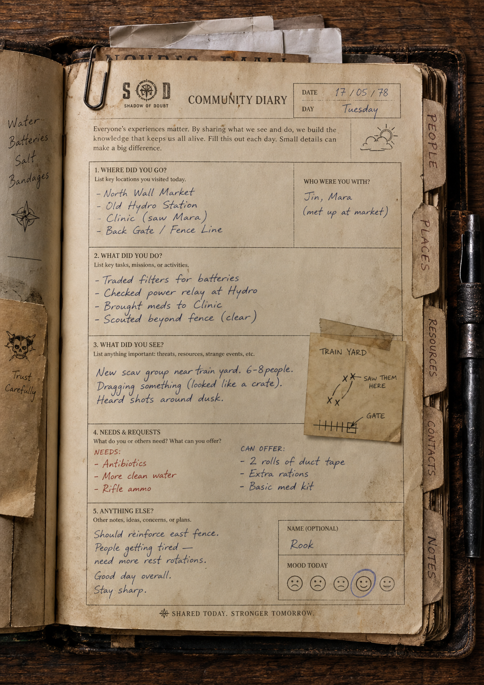

# Concept Art — original references

Source images that inspired the v2 metaphor live here. The images that drove the **leather field journal** direction were referenced visually during the design philosophy work (see [PHA-336 Plan rev 3 §1](/PHA/issues/PHA-336#document-plan)) but were never committed to the repo.

## What belongs in this folder

- Concept-art / key-art images used to seed the "Network Logbook" metaphor (the leather diary, the paperclipped index cards, the typewritten field-form aesthetic, the amber lamp).
- Any reference photos / paintings that anchored the §2 visual language palette and texture decisions.

## Current state

The **canonical** concept art ([`network-logbook.png`](./network-logbook.png)) is committed below. This is the image the v2 metaphor was built around — every design decision in [`/design/tokens.css`](../../design/tokens.css), [`/design/tokens.md`](../../design/tokens.md), and [`/design/moodboard.md`](../../design/moodboard.md) traces back to surfaces visible in this single page.

What it locks in (every line of the v2 design tracks one of these):

- **Leather book chrome** with visible spine and warped corners — `--leather`, `--leather-shadow`.
- **Aged cream paper** with edge stains, water rings, and a slight rotation per artifact — `--paper`, `--paper-stained`.
- **Typewriter section labels** in uppercase ("WHERE DID YOU GO?", "WHAT DID YOU DO?") — `--font-typewriter`, `--ink-brown`.
- **Ballpoint-blue handwriting** in the entries and survivor name — `--font-hand`, `--ink-blue`.
- **Mood-today smiley row** of penned faces — basis for the `morale` gauge component.
- **Side tabs** (PEOPLE / PLACES / RESOURCES / CONTACTS / NOTES) — locks the section taxonomy and the right-edge tab divider.
- **Paperclipped header note** with the "SHIELD OF SCOUT" / Network crosshair logo — basis for the brass-paperclip hardware and the anonymous "NETWORK" mark (Plan §10 brand/IP note).
- **Footer tagline** "SHARED TODAY, STRONGER TOMORROW." — the v2 footer keeps this verbatim.
- **Amber warmth** falling from the top-left across the spread — `--amber`, sets the single-light-source rule (Plan §2).

## Files

| Filename | Source / origin | Surface it informed | Date added |
|---|---|---|---|
| [`network-logbook.png`](./network-logbook.png) | User-provided original concept art (PHA-346 comment, 2026-05-02) | All of v2 — leather chrome, paper surface, ink palette, typewriter labels, handwriting, side tabs, mood gauge, paperclipped header, "SHARED TODAY, STRONGER TOMORROW." footer | 2026-05-02 |

## Naming convention

`<surface>-<short-slug>.png` works well — e.g. `leather-network-logbook.png`, `paper-field-form.png`, `lamp-amber-warmth.jpg`. Surface prefix lets the [mood board](../../design/moodboard.md) cross-reference these without fishing through a flat folder.

## Attribution

If a file is **not** original work, include the source URL, creator, and license alongside the filename above. CC0 entries don't strictly need attribution but it's a courtesy. CC-BY entries require it.
